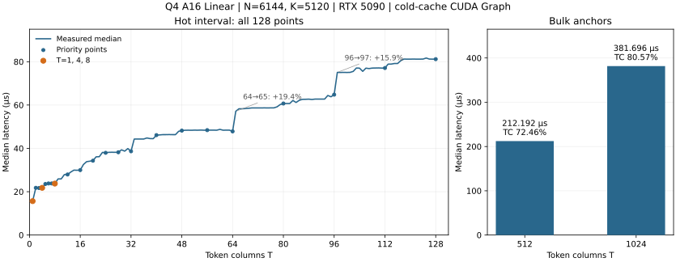

# Q4 Linear 性能报告：N=6144，K=5120

2026-09-26 重测。本文记录本阶段整理后的完整 Linear Op 性能，供评估该 shape 和后续调优参考。

## 测量对象与条件

| 项目 | 本次测量 |
|---|---|
| 权重 | `Q4_G64_FP16`，row-split layout；每 64 个权重共享一个 FP16 scale |
| 数学形状 | `W[6144,5120] × X[5120,T] → Y[6144,T]` |
| 输入、输出与 policy | BF16 输入、BF16 输出，`A16Only` |
| GPU / 驱动 | NVIDIA GeForce RTX 5090；617.14 |
| 构建 / CUDA | Release，`sm_120a`；运行库 13.4，benchmark 编译时 `CUDART_VERSION=13010` |
| 计时入口 | `ninfer::ops::linear`；每个 CUDA Graph 包含一次完整 Op 调用 |
| cache / 采样 | 每个样本前清除 256 MiB L2；5 次 warmup、30 次测量，报告 median |
| 输入 fixture | 使用公开 bench 的 Q4 packed-weight 和 BF16 activation fixture；数值验证另用非均匀权重与 scale |
| 覆盖 | T=1～128 每个整数，以及 512、1024；共 130 个点 |

所有被测调用均只有一个 Graph kernel 节点，外部 workspace 为零。测量范围是纯 Linear Op。
本次复用增量构建产物；bench 日志中的 `cuda_runtime` 来自编译时宏，实际加载的运行库版本另行查询。

## 最终耗时曲线



左图包含全部 128 个实测点，圆点标出重点 T，橙色强调 T=1、4、8；连线仅连接相邻实测点。
右图单独展示 512、1024，TC 百分比采用下文的逻辑算力口径。

## 逻辑带宽与 Tensor Core 利用率

权重包含 `6144 × 5120 / 64 × 34 = 16,711,680` 字节的 code 和 scale。
沿用 [Linear bench 指标定义](../linear-benchmark.md#5-数学工作量与-route-neutral-指标)：

```text
model_bytes = 16,711,680 + 2 × 5120 × T + 2 × 6144 × T
逻辑带宽 GB/s = model_bytes / seconds / 1e9
带宽利用率 = 逻辑带宽 / 1792 GB/s × 100%

有效算力 TFLOP/s = 2 × 6144 × 5120 × T / seconds / 1e12
TC 利用率 = 有效算力 / 209.5 TFLOP/s × 100%
```

分母取自 bench 的 RTX 5090 固定规格常量。T=1 使用 GEMV，TC 利用率填 `—`；
T≥2 的当前路径均使用 BF16 输入、FP32 累加的 dense MMA，对应 **209.5 TFLOP/s** 峰值。
bench 的 Q4 行未填充 TC 字段，本文按上述公式补算；不加入解码、padding 或额外 tile 工作量。
这些是逻辑工作量口径的利用率，并非硬件计数器测量，也不代表剩余百分比都是可追回的时间。

T=1 的逻辑带宽为 **1069.4 GB/s，标称带宽利用率 59.68%**；采用 bench 另列的
1674.5 GB/s 持续读参考时为 **63.86%**，对应 `READ_%` 口径。

| T | 延迟 µs | 逻辑带宽 GB/s | 带宽利用率 | 有效算力 TFLOP/s | TC 利用率 |
|---:|---:|---:|---:|---:|---:|
| 1 | 15.648 | 1069.4 | 59.68% | 4.02 | — |
| 2 | 21.792 | 768.9 | 42.91% | 5.77 | 2.76% |
| 3 | 21.696 | 773.4 | 43.16% | 8.70 | 4.15% |
| 4 | 21.792 | 771.0 | 43.02% | 11.55 | 5.51% |
| 5 | 23.552 | 714.3 | 39.86% | 13.36 | 6.38% |
| 6 | 23.808 | 707.6 | 39.49% | 15.86 | 7.57% |
| 7 | 23.808 | 708.6 | 39.54% | 18.50 | 8.83% |
| 8 | 23.744 | 711.4 | 39.70% | 21.20 | 10.12% |
| 12 | 27.936 | 607.9 | 33.92% | 27.03 | 12.90% |
| 16 | 29.984 | 569.4 | 31.77% | 33.57 | 16.02% |
| 20 | 34.304 | 500.3 | 27.92% | 36.68 | 17.51% |
| 24 | 37.952 | 454.6 | 25.37% | 39.79 | 18.99% |
| 28 | 38.208 | 453.9 | 25.33% | 46.11 | 22.01% |
| 32 | 38.656 | 451.0 | 25.17% | 52.08 | 24.86% |
| 40 | 46.112 | 382.0 | 21.31% | 54.58 | 26.05% |
| 48 | 48.192 | 369.2 | 20.60% | 62.66 | 29.91% |
| 56 | 48.416 | 371.2 | 20.72% | 72.77 | 34.73% |
| 64 | 47.840 | 379.5 | 21.18% | 84.17 | 40.18% |
| 80 | 60.704 | 305.0 | 17.02% | 82.91 | 39.58% |
| 96 | 64.800 | 291.3 | 16.25% | 93.21 | 44.49% |
| 112 | 77.088 | 249.5 | 13.92% | 91.41 | 43.63% |
| 128 | 81.184 | 241.4 | 13.47% | 99.20 | 47.35% |
| 512 | 212.192 | 133.1 | 7.43% | 151.81 | 72.46% |
| 1024 | 381.696 | 104.2 | 5.82% | 168.78 | 80.57% |

## 曲线解读与验证

[shape 实现](../../../src/ops/linear/q4/shapes/n6144_k5120.cu) 在 GEMV、CTA 内 sliced-K 和普通 MMA
之间选择；具体配置以源码为准。

- T=1→2 从 15.648 升至 21.792 µs（+39.26%），是热区最大的相邻涨幅，
  对应单 token GEMV 切换到 sliced-K。
- T=64→65 从 47.840 升至 57.120 µs（+19.40%）；T=96→97 从
  64.800 升至 75.072 µs（+15.85%）。这些生产路线交界的台阶仍然存在。
  同一路线内部也有台阶，例如 T=32→33 为 +14.57%；图中保留全部实测变化。
- T=512 为 **212.192 µs、151.81 TFLOP/s、72.46% TC 利用率**；
  T=1024 为 **381.696 µs、168.78 TFLOP/s、80.57% TC 利用率**。
  本轮仅重测两个大 T 锚点，未重新测量 129～511 或其他大 T 交界。

数值资格化复用本阶段已通过的 `ninfer_linear_q4_a16_test`：独立解码 packed Q4 code 与
FP16 scale，以 FP64 矩阵乘法为 oracle，按既有 A16 标准检查公开路线、代表性边界、输出 guard、
输入保持和改变输入后的 CUDA Graph 重放。本次只刷新计时与文档，未重新运行数值测试。

## 复现

```bash
cmake --build build -j --target ninfer_linear_bench

./build/bench/ninfer_linear_bench \
  --qtype q4 --policy a16 --n 6144 --k 5120 \
  --sweep 1:128:1 --execution graph --graph-calls 1 \
  --warmup 5 --repeat 30 --flush-mib 256 \
  --csv-out profiles/bench/q4_report_20260926/hot.csv
./build/bench/ninfer_linear_bench \
  --qtype q4 --policy a16 --n 6144 --k 5120 \
  --sweep 512:1024:512 --execution graph --graph-calls 1 \
  --warmup 5 --repeat 30 --flush-mib 256 \
  --csv-out profiles/bench/q4_report_20260926/bulk.csv
```

继续调优时，按 [Linear 调优与报告规范](../linear-tuning.md) 选择候选、验证数值并收敛分派。
本报告只描述上述测量条件下的该 shape，不代表其他 shape 或端到端推理性能。
